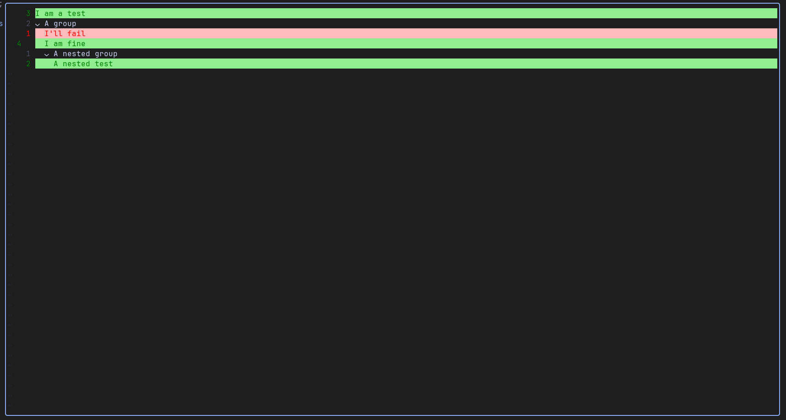
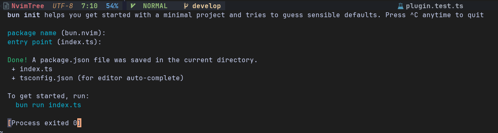
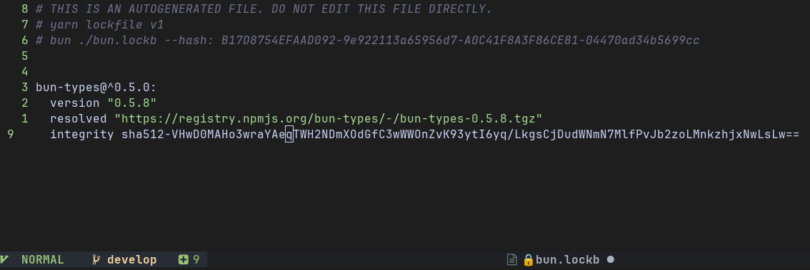
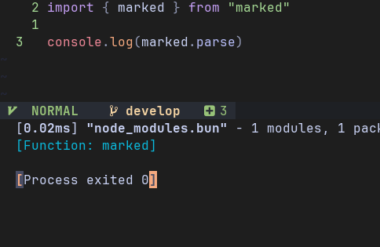
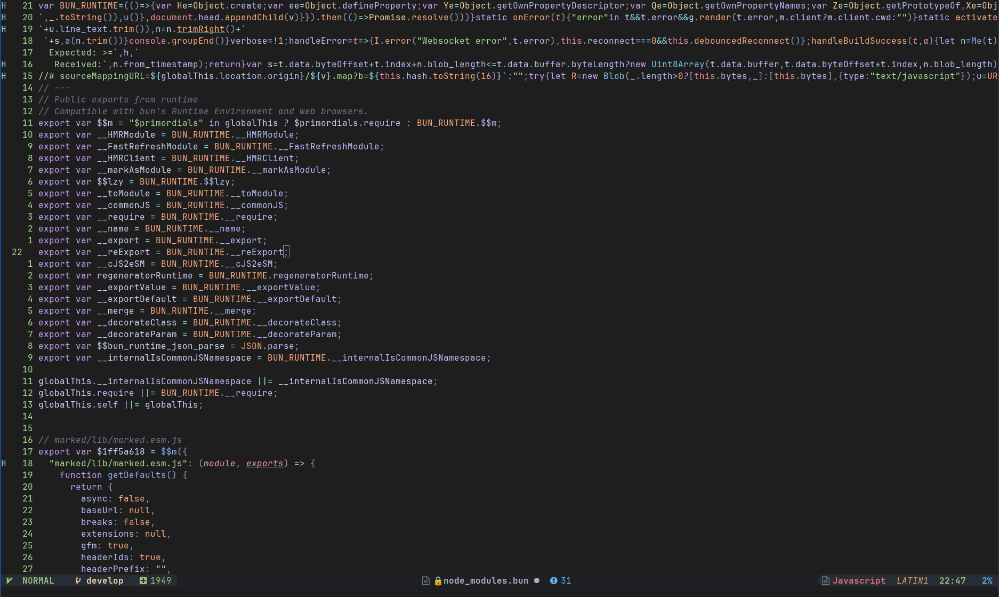

# bun.nvim

## NeoVim plugin for Bun JavaScript runtime

This plugin adds `Bun` subcommand and shows `node_modules.bun` and `bun.lockb` files

Now with test support!


If test passed, it is highlighted with green, if it failed then with red

# Installation 

### use your favorite package manager

Examples: <br>

using `packer`
```lua
use('akinsho/toggleterm.nvim') -- this is a must!
use('Fire-The-Fox/bun.nvim')
```

<br>

using `vim-plug`
```vim
Plug 'akinsho/toggleterm.nvim' " this is a must!
Plug 'Fire-The-Fox/bun.nvim'
```

# Configuring

```lua
require("bun").setup({
    close_on_exit = true | false, -- if the terminal window should close instantly after bun exited
    cwd = "current" | "relative", -- run_current's working directory
    -- if "current" it will use current working directory of NeoVim
    -- if "relative" it will use directory where the file is located
    direction = "horizontal" | "float" -- float will create floating window and horizontal will put it under buffers 
})
```

```lua
require("bun.tests").setup({
    -- configure the test window
    width = 0.9, -- range 0.0 <-> 1.0, if you want you can use % / 100 to get the value
    height = 0.8, -- range 0.0 <-> 1.0, same as on top but
    border = "none" | "single" | "double" | "rounded" | "solid" | "shadow" -- style of the border
})
```

# API

### API is still not finished, but you can bind run_current as a keybinding to neovim

```lua
local bun = require("bun")

-- setup it your way
bun.setup({})

-- in my case <leader> is spacebar, so i hit "spacebar + b + r" and it will run current file
vim.keymap.set("n", "<leader>br", bun.run_current)
```

### bun.nvim now has `bun test` support! Kind of

```lua
local bun_test = require("bun.tests")

-- setup it your way
bun_test.setup({})

-- same as before
vim.keymap.set("n", "<leader>bt", bun_test.handler)
```

# Screenshots

### Creating test project


### Reading `bun.lockb`


### Running current file


### Reading `node_modules.bun` bundle


### Writing bunch of tests


### Opening window containing tests and runnig all manually with `<leader>r`


